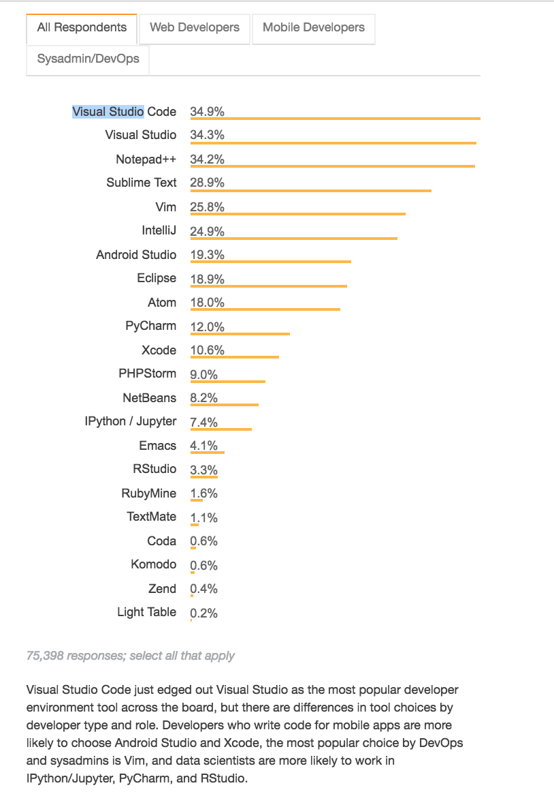

# Visual Studio Code:  Intro & Installation

## Intro
- Open-sourced
- Developed by Microsoft
- Works on Windows, Linux, MacOS
- In the Stack Overflow [2018 Developer Survey](https://insights.stackoverflow.com/survey/2018/), VSC was ranked the most popular!
- Popular also because of rich extensions ecosystem
  - Python is the most popular extension for VSC
- Fast, lightweight
- Features
  - IntelliSense:  code-completion aid
  - Debugging
  - Source control:  integrates with Git

*You choice of editor is one of the **most important** decisions you can make for your personal productivity.*  
-- Dan Taylor

[Most Popular Development Environments](https://insights.stackoverflow.com/survey/2018/#technology-most-popular-development-environments)

 
   
 

---

## Installing VSC 

- [Installation](https://code.visualstudio.com)
- [Documentation](https://code.visualstudio.com/docs/getstarted/userinterface)
