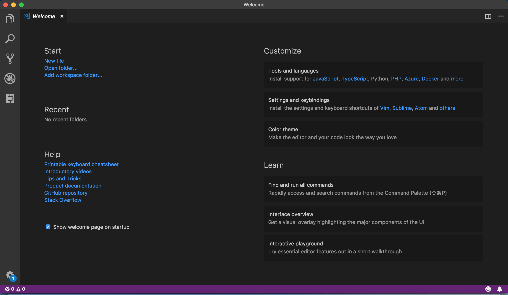
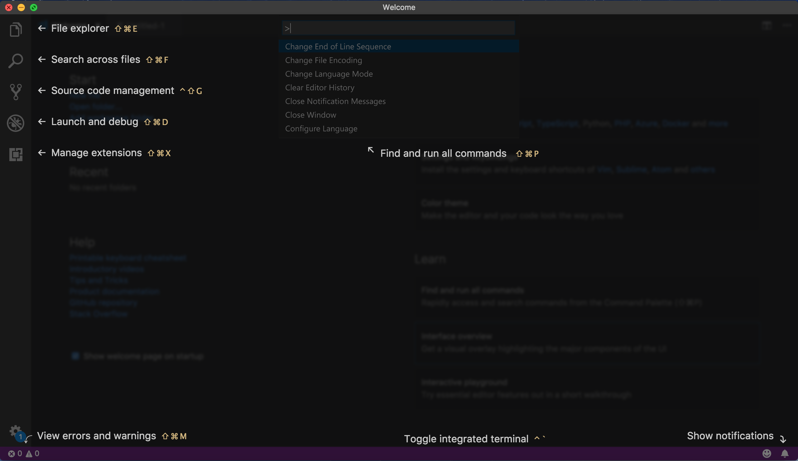
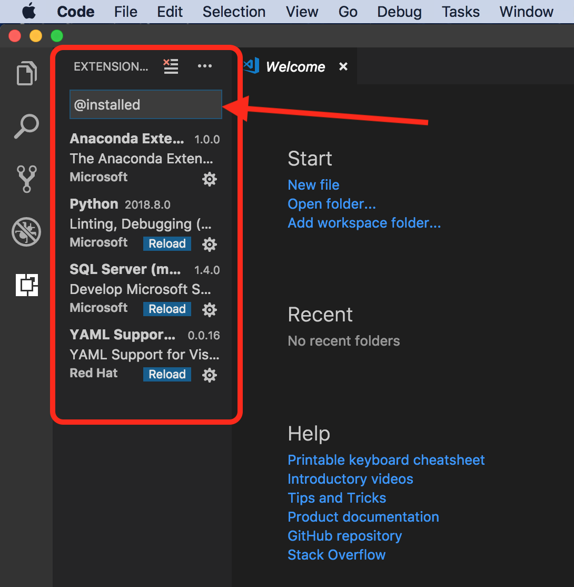
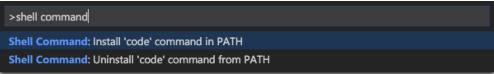

# Setting Up Visual Studio Code

## `Welcome` screen
This is what your `Welcome` screen looks like:  
There are 2 ways to get to your "Welcome" page:  
1. <kbd> F1 </kbd>, then type `Welcome`
2.  <kbd> shift ⌘ P </kbd>, then type `Welcome`

<br>
   
</br>


## Interface Overview
On your `Welcome` tab, select `Interface Overview`:  
This gives us an idea of what the different icons represent.  
(<kbd> esc (escape) </kbd> to exit)

<br>
   
</br>

## Customization

### Tools & Languages
- on `Welcome` tab
- `Customize` / `Tools and Languages` / 
- These are the default installed languages 
- To select any more, type `@sort:installs`

<br>
   
</br>


### Install extension:  "Python"
- on `Welcome` tab
- `Customize` / `Tools and Languages` / 
- These are the default installed languages 
- To select any more, type `@sort:installs`
- type "python"


### Install extension:  "Shell Command" 
In order to open Visual Studio Code directly from your Command Line by typing `code`, you need to install the Shell Command feature:  
- First, open the Command Palette in Visual Studio Code (`shift ⌘ P`)
- then type `shell command` in the search bar. 
- select:  "Shell Command:  Install 'code' command in Path"

   

Choose the option to install the 'code' command. You will then be able to navigate to your working directory from your terminal with:
```bash
code .
```

Or open a single file with:
```bash
code myfile.py
```

### Settings & Key Bindings (explore on your own)
- on `Welcome` tab
- will show how to get to to `Key Bindings` (2nd option on right)
- Can install the settings and keyboard shortcuts of other editors (such as Vim, Sublim, Atom, Emacs, and others); we can search for various editors
- attendees can install later.  best to not install now. 

### Color Theme
- on `Welcome` tab
- will show how to get to to `Color theme` (3rd option on right)
- can see list of installed themes and get a preview
- can get more themes from [Marketplace](https://marketplace.visualstudio.com/search?target=VSCode&category=Themes&sortBy=Downloads)

---

##  Settings
There are a few ways to get to `Settings` for editor, extensions, workspace, and more:  
1.  From menu:  `Code` / `Preferences` / `Settings` 
2.  This shortcut:  <kbd> Command+, </kbd>
3.  <kbd> `⇧⌘P` </kbd> and type "settings"

---


## Learn / Interactive Playground
- <kbd> shift ⌘ P </kbd> 
- type:  "open settings"
  1.  User settings
  2.  Workspace settings (separate for each project)
  
