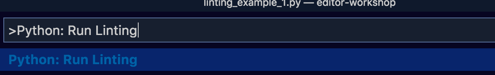
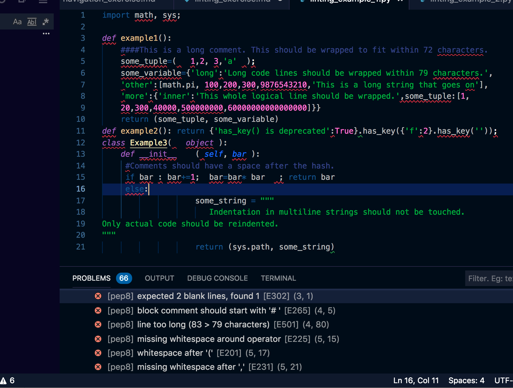

## Linting in Visual Studio Code

An easy way to prevent syntax errors and make your code more readable is to use a "linter", or code style guide. 

One of the most popular Python linters is called [pep8](https://www.python.org/dev/peps/pep-0008/#id10). It was also written by Guido van Rossum (the author of Python)!

### Install
Open the Command Palette <kbd>⇧⌘P</kbd> (for windows, use <kbd>Ctrl + Shift + P</kbd>)and type "Python: Select Linter". Choose `pep8`.

Now go to the extensions marketplace and type `autopep8`. Install the `Python-autopep8` library as well.

### 
Verify which linter you are currently using by opening the Command Palette <kbd> ⇧⌘P </kbd> (for windows, use <kbd>Ctrl + Shift + P</kbd>) and typing "Python Select Linter".

### Run the linter
Let's try out a linter on a code snippet. You can either git clone this repo and open up `linting_example_1.py`, or just create a new .py file and copy and paste the following code into it, and save. 

```
import math, sys;

def example1():
    ####This is a long comment. This should be wrapped to fit within 72 characters.
    some_tuple=(   1,2, 3,'a'  );
    some_variable={'long':'Long code lines should be wrapped within 79 characters.',
    'other':[math.pi, 100,200,300,9876543210,'This is a long string that goes on'],
    'more':{'inner':'This whole logical line should be wrapped.',some_tuple:[1,
    20,300,40000,500000000,60000000000000000]}}
    return (some_tuple, some_variable)
def example2(): return {'has_key() is deprecated':True}.has_key({'f':2}.has_key(''));
class Example3(   object ):
    def __init__    ( self, bar ):
     #Comments should have a space after the hash.
     if bar : bar+=1;  bar=bar* bar   ; return bar
     else:
                    some_string = """
                       Indentation in multiline strings should not be touched.
Only actual code should be reindented.
"""
                    return (sys.path, some_string)
```
<br />

Go to the Command Palette with <kbd> ⇧⌘P </kbd> (for windows, use <kbd>Ctrl + Shift + P</kbd>) and type: "Python: Run Linting".

 

Your file will now begin to underline errors, but to see them in a more easy-to-read-format, click on the caution triangle sign in the bottom left-hand corner. ⚠️

You should see a large number of syntax errors!

 

### Automatically fix errors with autopep8
You can automatically fix some of the more simple pep8 errors, like extra whitespaces, by opening the command palette and running "Format document".

Try it on linting_example_1.py and press save. You'll see the linting errors go from 66 to 16! 

If you'd like to try linting another example piece of code with some pep8 errors, use this [pig latin maker](5_3_linting_example_2.py). 
