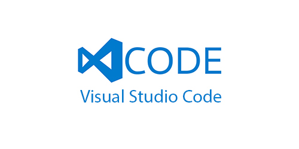
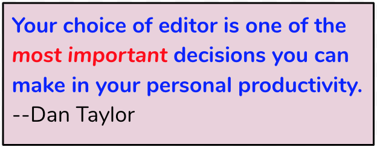
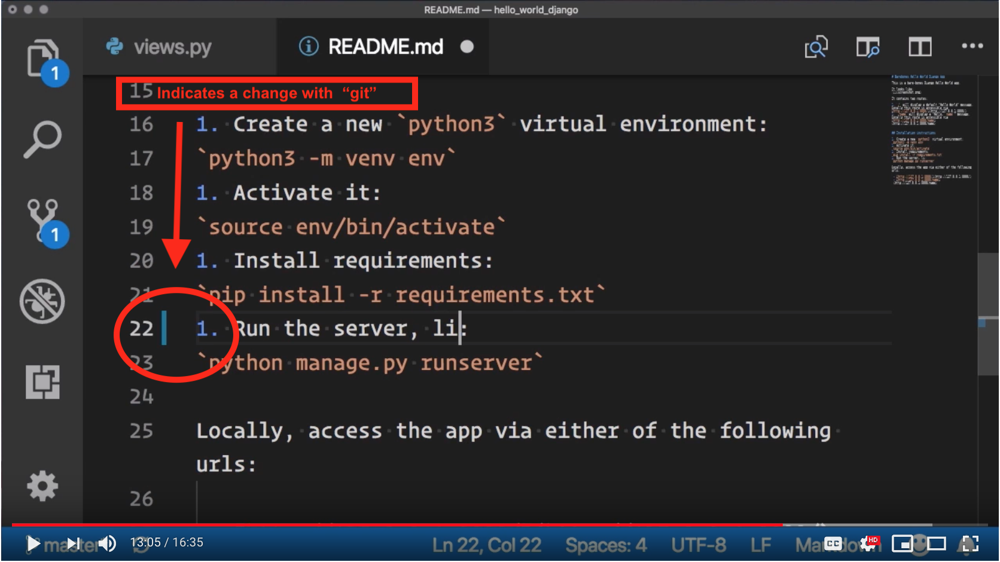

# Visual Studio Code (VSC) Editor Workshop
 

  
  
  
   

## Presenters (your NYC PyLadies organizers)
- [Reshama Shaikh](https://reshamas.github.io)   | [@reshamas](https://twitter.com/reshamas) on Twitter
- [Antonia Blair](https://www.linkedin.com/in/antonia-blair/)  | [@AntoniaBlairArt](https://twitter.com/AntoniaBlairArt) on Twitter

## Logistics:  PyLadies & Dropbox
- Introductions 
- Bathroom, wifi
- Code of Conduct
- Tweet about event:  
  - [@NYCPyLadies](https://twitter.com/NYCPyLadies) and also [@Dropbox](https://twitter.com/Dropbox)
  - [@pythonvscode](https://twitter.com/pythonvscode) | #VisualStudio | [@code](https://twitter.com/code)
- Thank you to Dropbox for hosting!
- [Dan Crosta](https://www.linkedin.com/in/dcrosta/) talks about Dropbox

## Workshop Introduction
- Attendee intros
  - what coding languages do people use?  
  - Answer [**poll here**](https://goo.gl/forms/Cgl6INnleVoe15Li1)
  - Let's look at [**responses here**](https://docs.google.com/forms/d/1Z2BQkppwp07V-UR_HomogM9ubgFP_zF7qkjKiH-57u4/edit#responses)
- Use [**this document**](https://docs.google.com/document/d/16tg-OMYO6NOFSFH7RH1KqNz2aS40mGDzOPA_yfBtsas/edit?usp=sharing) to let us know when you are finished with installs / exercises.

## Intro & Installing VSC 

- [0_intro_install](0_intro_install.md)

## Set-up
- [1_setup](1_setup.md)
- Install extensions
  - Python  
  - Shell Command

## Gettings some code to work with
Let's practice using some VSC shortcuts and features!
- We'll work with this small [Django blog](https://github.com/antoniablair/my-first-blog)
  - use `git clone` or `Download manually` (GH account *not required* to download the repo)

## Navigating the codebase
- How to [navigate this codebase](4_1_navigation_walkthrough.md)
- See if you can complete the [following exercise](4_2_navigation_exercise.md)
- To learn more about Django, you can build this blog at home with: [Django Girls tutorial](https://tutorial.djangogirls.org/en/)

## Important keyboard shortcuts
- [2_1_vsc_shortcuts](2_1_vsc_editor_shortcuts.md)
- [2_2_editor_shortcuts](2_2_editor_shortcuts.md)

## Linting and Formatting
- Install extensions for a linter (code style guide)
  - PEP8 linting, autopep8 extension
- Try a [short linting exercise](5_1_linting_exercise.md)
- If you install autopep8, you can then type “format document” in the Command Palette to run the linter on your file.

## Git Integration
- VSC provides great Git integration.  If you make a change to a file, you will see a blue vertical bar.
- Click on it, and it will show a small inline diff.
- You can also click on the "version control" icon on the left sidebar.  (3rd icon down, after magnifying glass icon). That shows differences, just like it would show on GitHub
- Click on top icon (two files) to get back to the code

 
   
 

---

## Fun / and for stress reduction
- Stressed after coding for hours? Need a break? Perhaps an inspiration? Something to calm your nerves after almost pushing that fatal git commit? It's Kitty Time! =(＾● ⋏ ●＾)= ෆ
- [Kitty extension on VSC](https://marketplace.visualstudio.com/items?itemName=QzSG.kitty-time)

## Explore on your own
- watch these 2 videos:
  - [PyLadies NYC - Getting Started with VS Code for Python](https://www.youtube.com/watch?v=xQj3s3wIYDY) by Nina Zakharenko @Microsoft
  - [Get Productive with Python in Visual Studio Code](https://www.youtube.com/watch?v=6YLMWU-5H9o) by Dan Taylor @Microsoft

### More git 
- You can access git options from the command palette:  <kdb> F1 </kbd>, type "stage"
- Git plugins to explore:
  - git lens plugin
  - integration with GitHub pull requests 
- Can click on last icon on left sidebar for `Extensions`
- Can search for "github pull request", click on `install` and then `reload` to activate it

### Terminal and Debugging with VSC
- Watch 4:06 - 9:31 of [Nina Zakharenko's helpful video](https://youtu.be/xQj3s3wIYDY?t=246), which explains how the terminal and debug features work

### Virtual Environments in VSC

